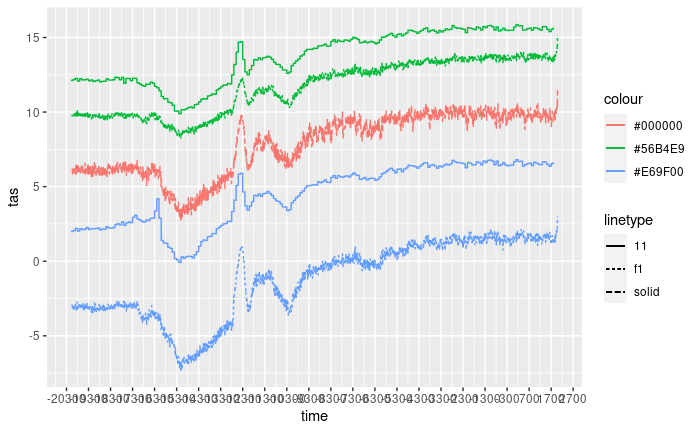
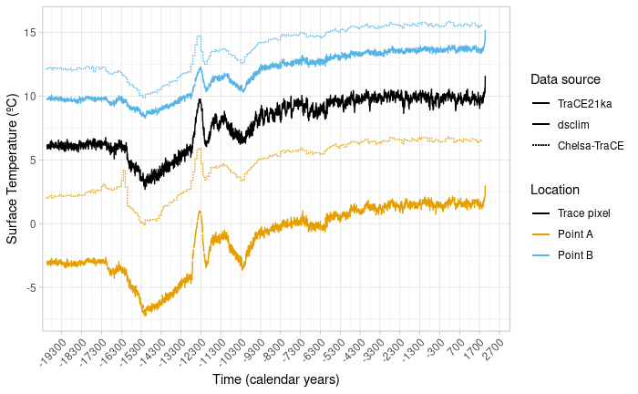

```{r, include = FALSE}
knitr::opts_chunk$set(
  collapse = TRUE,
  eval = FALSE,
  comment = "#>"
)
```


## Extracting point data from downscaled climate files.

Here we select the start and the end of our study period, and the locations which we are interested in. We use these values to extract information of our climate data. We also aggregate the data by ten years to avoid an excess of fluctuation in our example plot. 

```{r load_dsclim_data}
library(dsclimtools)
library(dplyr)
library(ggplot2)

start <- -22000
end <- 40

agg.dates <- calendar_dates(start, end + 10, by =  "10 year")

points <- c(0, 41.5, 0, 42.8) %>% matrix(ncol = 2, nrow = 4, byrow = TRUE) %>% as.data.frame() %>% sf::st_as_sf(coords = c("V1", "V2"))

data <- dsclimtools::read_dsclim( "../../Output", "tas", start, end, calendar_dates = TRUE, sf = points, proxy = FALSE) %>% aggregate(by = agg.dates, FUN = mean, na.rm = TRUE) 

figure <- ggplot() +
    geom_line(data = as.data.frame(data), aes(x = time, y = tas, colour = st_as_text(geometry), linetype = "f1"))

figure
```


## Importing TraCE21ka data

Here we charge the TraCE21Ka pixel in which point 1 and point 2 are included.

```{r load_trace_data} 
# datatrace <- dsclimtools::read_trace("../../Data/TraCE21ka", "TS", point1) %>% aggregate(by = agg.dates, FUN = mean, na.rm = TRUE)
datatrace <- dsclimtools::read_trace("../../Data/TraCE21ka", "TS", st_set_crs(points[1,], 4326)) %>% aggregate(by = agg.dates, FUN = mean, na.rm = TRUE)

figure <- figure + geom_line(data = as.data.frame(datatrace), aes(x = time, y = TS, colour = "#000000", linetype = "solid"))

figure
```


## Extracting CHELSA point data

Here we extract point data from CHELSA, in this case we charged on the one hand maximum temperature and on the other hand minimun temperature. Once we have their point data (and we have made some unit conversion) we calculate average temperature.

```{r load_chelsa_data} 
chelsa_tmax <- "../../Data/chelsa_trace/tasmax/CHELSA_TraCE21k_tasmax_"
chelsa_tmin <- "../../Data/chelsa_trace/tasmin/CHELSA_TraCE21k_tasmin_"

pixel1 <- sf::st_read("../../10-Paper/02-Figure_timeseries_ds-chelsa/pixel1.gpkg")
pixel2 <- sf::st_read("../../10-Paper/02-Figure_timeseries_ds-chelsa/pixel2.gpkg")

df <- expand.grid(1:12, -200:20)
chelsa_tmax_files <- paste0("../../Data/chelsa_trace/tasmax/CHELSA_TraCE21k_tasmax_", df$Var1, "_", df$Var2, "_V1.0.tif")
chelsa_tmin_files <- paste0("../../Data/chelsa_trace/tasmin/CHELSA_TraCE21k_tasmin_", df$Var1, "_", df$Var2, "_V1.0.tif")

df <- expand.grid(1:12, seq(from= -20100, to=1900,  by= 100))
chelsa_dates <- lubridate::ymd(paste0("0000-", df$Var1, "-01")) + lubridate::years(df$Var2)
      
chelsa_tmax_pixel1 <- read_stars(chelsa_tmax_files, along = "time") %>% st_set_dimensions(which = "time", values = chelsa_dates) %>% aggregate(by = pixel1, FUN = mean)
chelsa_tmax_pixel1 <- ((chelsa_tmax_pixel1 * 0.1) - 273) 
  
chelsa_tmin_pixel1 <- read_stars(chelsa_tmin_files, along = "time") %>% st_set_dimensions(which = "time", values = chelsa_dates) %>% aggregate(by = pixel1, FUN = mean)
chelsa_tmin_pixel1 <- ((chelsa_tmin_pixel1 * 0.1) - 273)

chelsa1 <- ((chelsa_tmax_pixel1 + chelsa_tmin_pixel1) / 2) %>% aggregate(dsclimtools::calendar_dates(-22050, 40, by = "100 years"), FUN=mean, na.rm=TRUE)
  
chelsa_tmax_pixel2 <- read_stars(chelsa_tmax_files, along = "time") %>% st_set_dimensions(which = "time", values = chelsa_dates) %>% aggregate(by = pixel2, FUN = mean)
chelsa_tmax_pixel2 <- ((chelsa_tmax_pixel2 * 0.1) - 273) 

chelsa_tmin_pixel2 <- read_stars(chelsa_tmin_files, along = "time") %>% st_set_dimensions(which = "time", values = chelsa_dates) %>% aggregate(by = pixel2, FUN = mean)
chelsa_tmin_pixel2 <- ((chelsa_tmin_pixel2 * 0.1) - 273)

chelsa2 <- ((chelsa_tmax_pixel2 + chelsa_tmin_pixel2) / 2) %>% aggregate(dsclimtools::calendar_dates(-22050, 40, by = "100 years"), FUN=mean, na.rm=TRUE)


figure <- figure + 
    geom_step(data = as.data.frame(chelsa1), aes(x = time, y = attr, colour = "POINT (0 41.5)", linetype = "11")) +
    geom_step(data = as.data.frame(chelsa2), aes(x = time, y = attr, colour = "POINT (0 42.8)", linetype = "11"))

figure
```



## Plotting the data

Here we just plot all the data together to have a look of the similarities and differences between the different sources.

```{r finish_plot} 
figure + 
    theme_light() +
    theme(axis.text.x=element_text(angle = 45, hjust = 1)) +
    labs(y = "Surface Temperature (ºC)", x = "Time (calendar years)") +
    coord_cartesian(xlim = c(lubridate::ymd("1950-01-01") + c(lubridate::years(-21150), lubridate::years(240)))) +
    
    scale_linetype_identity(name = "Data source",
                            breaks = c("solid", "f1", "11"),
                            labels = c("TraCE21ka", "dsclim", "Chelsa-TraCE"),
                            guide = "legend") +
  
    scale_color_manual(values=c("#000000", "#E69F00", "#56B4E9"),
                       labels = c("Trace pixel", "Point A", "Point B"),
                       guide = "legend",
                       name = "Location")
```

