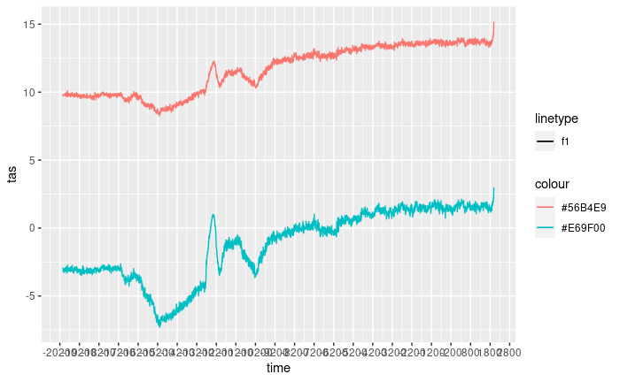
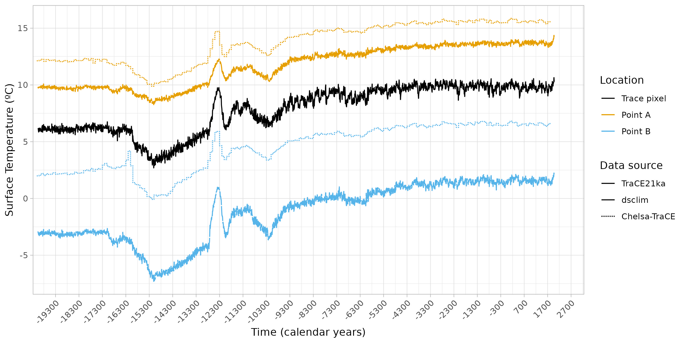
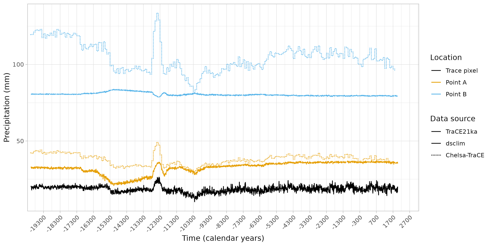

```{r, include = FALSE}
knitr::opts_chunk$set(
  collapse = TRUE,
  eval = FALSE,
  comment = "#>"
)
```

## Extracting point data from downscaled climate files. {.tabset .tabset-pills}

One of the key benefits of having higher-resolution data is the ability to distinguish between different climatic conditions in nearby areas with varying topography. At lower resolutions, these conditions were often grouped into a single pixel, represented by a single value. To demonstrate this, we will select the start and end dates of our study period, as well as the locations of interest. We will then extract information from our climate data and aggregate it by ten years to avoid fluctuations in our example plot.

### TS

```{r ts_load_dsclim_data}
library(dsclimtools)
library(dplyr)
library(ggplot2)

start <- -22000
end <- 40

agg.dates <- calendar_dates(start, end, by =  "10 year")

points <- data.frame(id = c(1, 2), 
                     long = c(0, 0), 
                     lat = c(41.5, 42.8)) %>% 
           sf::st_as_sf(coords = c("long", "lat"))

data <- dsclimtools::read_dsclim( "../data", 
                                  "tas", 
                                  start, 
                                  end, 
                                  calendar_dates = TRUE, 
                                  sf = points, 
                                  proxy = FALSE) %>% 
        aggregate(by = agg.dates, FUN = mean, na.rm = TRUE) 

figure <- ggplot() +
    geom_line(data = as.data.frame(data), 
              aes(x = time, 
                  y = tas, 
                  colour = st_as_text(geometry), 
                  linetype = "f1"))

figure
```



### PR

```{r pr_load_dsclim_data}
library(dsclimtools)
library(dplyr)
library(ggplot2)

start <- -22000
end <- 40

agg.dates <- calendar_dates(start, 
                            end, 
                            by =  "10 year")

points <- data.frame(id = c(1, 2), 
                     long = c(0, 0), 
                     lat = c(41.5, 42.8)) %>% 
          sf::st_as_sf(coords = c("long", "lat"))

data <- dsclimtools::read_dsclim( "../data", 
                                  "pr", 
                                  start, 
                                  end, 
                                  calendar_dates = TRUE, 
                                  sf = points, 
                                  proxy = FALSE) %>% 
        aggregate(by = agg.dates, 
                  FUN = mean, 
                  na.rm = TRUE) 

figure <- ggplot() +
    geom_line(data = as.data.frame(data), 
              aes(x = time, 
                  y = pr, 
                  colour = st_as_text(geometry), 
                  linetype = "f1"))

figure
```


## Importing TraCE21ka data {.tabset .tabset-pills}

The objective is to compare the higher resolution data with its lower resolution counterpart and test if the downscaled data accurately reflects the differences between the two points. In this case, we are focusing on the TraCE21Ka pixel, which includes points 1 and 2.

### TS

```{r ts_load_trace_data}
datatrace <- dsclimtools::read_trace("../data/TraCE21ka", 
                                     "TS", 
                                     st_set_crs(points[1,], 4326)) %>% 
             aggregate(by = agg.dates, 
                       FUN = mean, 
                       na.rm = TRUE)

figure <- figure + geom_line(data = as.data.frame(datatrace), 
                             aes(x = time, 
                                 y = TS, 
                                 colour = "#000000", 
                                 linetype = "solid"))

figure
```


### PR

```{r pr_load_trace_data}
datatrace <- dsclimtools::read_trace("../data/TraCE21ka", 
                                     "PRECC", 
                                     st_set_crs(points[1,], 4326)) %>% 
             aggregate(by = agg.dates, 
                       FUN = mean, 
                       na.rm = TRUE)

figure <- figure + geom_line(data = as.data.frame(datatrace), 
                             aes(x = time, 
                                 y = TS, 
                                 colour = "#000000", 
                                 linetype = "solid"))

figure
```


## Extracting CHELSA point data {.tabset .tabset-pills}

During the development of this dataset, we conducted an external data validation exercise with the aim of uncovering any potential procedure bias. To this end, we extracted point data from CHELSA TraCE21k, focusing on both maximum and minimum temperature. Following the collection of this data and the completion of necessary unit conversion, we proceeded to calculate the average temperature.

### TS

```{r load_chelsa_data}
pixel1 <- sf::st_read("../data/pixel1.gpkg")
pixel2 <- sf::st_read("../data/pixel2.gpkg")

df1 <- expand.grid(1:12, -200:20)

df2 <- expand.grid(1:12, seq(from= -20100, to=1900,  by= 100))
chelsa_dates <- lubridate::ymd(paste0("0000-", df2$Var1, "-01")) + lubridate::years(df2$Var2)

chelsa_tmax <- "../data/chelsa_trace/tasmax/CHELSA_TraCE21k_tasmax_"
chelsa_tmin <- "../data/chelsa_trace/tasmin/CHELSA_TraCE21k_tasmin_"

chelsa_tmax_files <- paste0(chelsa_tmax, df1$Var1, "_", df1$Var2, "_V1.0.tif")
chelsa_tmin_files <- paste0(chelsa_tmin, df1$Var1, "_", df1$Var2, "_V1.0.tif")

chelsa_tmax_pixel1 <- read_stars(chelsa_tmax_files, along = "time") %>% 
                      st_set_dimensions(which = "time", values = chelsa_dates) %>% 
                      aggregate(by = pixel1, FUN = mean)
chelsa_tmax_pixel1 <- ((chelsa_tmax_pixel1 * 0.1) - 273) 
  
chelsa_tmin_pixel1 <- read_stars(chelsa_tmin_files, along = "time") %>% 
                      st_set_dimensions(which = "time", values = chelsa_dates) %>% 
                      aggregate(by = pixel1, FUN = mean)
chelsa_tmin_pixel1 <- ((chelsa_tmin_pixel1 * 0.1) - 273)

chelsa1 <- ((chelsa_tmax_pixel1 + chelsa_tmin_pixel1) / 2) %>% 
           aggregate(dsclimtools::calendar_dates(-22050, 40, by = "100 years"), FUN=mean, na.rm=TRUE)
  
chelsa_tmax_pixel2 <- read_stars(chelsa_tmax_files, along = "time") %>% 
                      st_set_dimensions(which = "time", values = chelsa_dates) %>% 
                      aggregate(by = pixel2, FUN = mean)
chelsa_tmax_pixel2 <- ((chelsa_tmax_pixel2 * 0.1) - 273) 

chelsa_tmin_pixel2 <- read_stars(chelsa_tmin_files, along = "time") %>% 
                      st_set_dimensions(which = "time", values = chelsa_dates) %>% 
                      aggregate(by = pixel2, FUN = mean)
chelsa_tmin_pixel2 <- ((chelsa_tmin_pixel2 * 0.1) - 273)

chelsa2 <- ((chelsa_tmax_pixel2 + chelsa_tmin_pixel2) / 2) %>% 
           aggregate(dsclimtools::calendar_dates(-22050, 40, by = "100 years"), FUN=mean, na.rm=TRUE)


figure <- figure + 
    geom_step(data = as.data.frame(chelsa1),
              aes(x = time, 
                  y = attr, 
                  colour = "POINT (0 41.5)", 
                  linetype = "11")) +
    geom_step(data = as.data.frame(chelsa2), 
              aes(x = time,
                  y = attr, 
                  colour = "POINT (0 42.8)",
                  linetype = "11"))

figure
```


### PR

```{r}
pixel1 <- sf::st_read("../data/pixel1.gpkg")
pixel2 <- sf::st_read("../data/pixel2.gpkg")

df1 <- expand.grid(1:12, -200:20)

df2 <- expand.grid(1:12, seq(from= -20100, to=1900,  by= 100))
chelsa_dates <- lubridate::ymd(paste0("0000-", df2$Var1, "-01")) + lubridate::years(df2$Var2)


chelsa_pr <- "../data/chelsa_trace/pr/CHELSA_TraCE21k_pr_"

chelsa_pr_files <- paste0(chelsa_pr, df1$Var1, "_", df1$Var2, "_V1.0.tif")

chelsa_pr_pixel1 <- read_stars(chelsa_pr_files, along = "time") %>% 
                    st_set_dimensions(which = "time", values = chelsa_dates) %>%
                    aggregate(by = pixel1, FUN = mean)

chelsa1 <- chelsa_pr_pixel1 %>% 
             aggregate(dsclimtools::calendar_dates(-22050, 40, by = "100 years"), 
                       FUN=mean, 
                       na.rm=TRUE)

chelsa_pr_pixel2 <- read_stars(chelsa_pr_files, along = "time") %>% 
                    st_set_dimensions(which = "time", values = chelsa_dates) %>%
                    aggregate(by = pixel2, FUN = mean)

chelsa2 <- chelsa_pr_pixel2 %>% 
             aggregate(dsclimtools::calendar_dates(-22050, 40, by = "100 years"), 
                       FUN=mean, 
                       na.rm=TRUE)

figure <- figure +
  geom_step(data = as.data.frame(chelsa1), 
            aes(x = time, 
                y = attr, 
                colour = "POINT (0 41.5)", 
                linetype = "11")) +
  geom_step(data = as.data.frame(chelsa2), 
            aes(x = time, 
                y = attr, 
                colour = "POINT (0 42.8)", 
                linetype = "11"))

figure

```


## Plotting the data {.tabset .tabset-pills}

The objective here is to plot all the data together in order to gain insight into the similarities and differences between the various sources.

### TS

```{r finish_plot}
figure + 
    theme_light() +
    theme(axis.text.x=element_text(angle = 45, hjust = 1)) +
    labs(y = "Surface Temperature (ºC)", 
         x = "Time (calendar years)") +
    coord_cartesian(xlim = c(lubridate::ymd("1950-01-01") + c(lubridate::years(-21150),
                                                              lubridate::years(240)))) +
    
    scale_linetype_identity(name = "Data source",
                            breaks = c("solid", "f1", "11"),
                            labels = c("TraCE21ka", "dsclim", "Chelsa-TraCE"),
                            guide = "legend") +
  
    scale_color_manual(values=c("#000000", "#E69F00", "#56B4E9"),
                       labels = c("Trace pixel", "Point A", "Point B"),
                       guide = "legend",
                       name = "Location")
```



### PR

```{r}
figure +
  theme_light() +
  theme(axis.text.x=element_text(angle = 45, hjust = 1)) +
  labs(y = "Precipitation (mm)", 
       x = "Time (calendar years)") +
  coord_cartesian(xlim = c(lubridate::ymd("1950-01-01") + c(lubridate::years(-21150), 
                                                            lubridate::years(240)))) +

  scale_linetype_identity(name = "Data source",
                          breaks = c("solid", "f1", "11"),
                          labels = c("TraCE21ka", "dsclim", "Chelsa-TraCE"),
                          guide = "legend") +

  scale_color_manual(values=c("#000000", "#E69F00", "#56B4E9"),
                     labels = c("Trace pixel", "Point A", "Point B"),
                     guide = "legend",
                     name = "Location")
```


