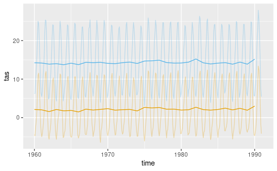
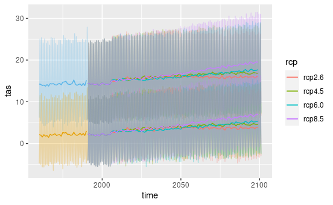
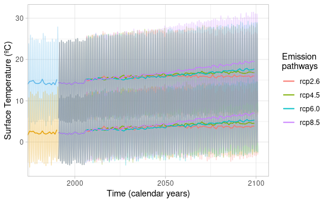

```{r, include = FALSE}
knitr::opts_chunk$set(
  collapse = TRUE,
  echo = TRUE,
  message = FALSE,
  warning = FALSE,
  eval = FALSE,
  comment = "#>"
)
```

## Loading past data into R environment

Here we charge the downscaled past climate data into R. For this example, We extract a 30 years period (i.e., 1960-1990) in two locations.

```{r load_past_data}
library(dsclimtools)
library(stars)
library(units)
library(ggplot2)

point1 <- sf::st_point(x = matrix(c(0, 41.5), 1, 2), dim = "XYZ")
point2 <- sf::st_point(x = matrix(c(0, 42.8), 1, 2), dim = "XYZ")
  
past1 <- dsclimtools::read_dsclim("../../Output", "tas", 10, 40, calendar_dates = TRUE, sf = point1, proxy = FALSE)
past2 <- dsclimtools::read_dsclim("../../Output", "tas", 10, 40, calendar_dates = TRUE, sf = point2, proxy = FALSE)

 figure <- ggplot2::ggplot() +
    
    ggplot2::geom_line(data = drop_units(as.data.frame(past1)), aes(x = time, y = tas), color = "#56B4E9", alpha = 0.3) + 
    ggplot2::geom_line(data = drop_units(as.data.frame(aggregate(past1, by = calendar_dates(10, 41, "1 year"), FUN = mean, na.rm = TRUE))), aes(x = time, y = tas), color = "#56B4E9") + 
    
    ggplot2::geom_line(data = drop_units(as.data.frame(past2)), aes(x = time, y = tas), color = "#E69F00", alpha = 0.3) + 
    ggplot2::geom_line(data = drop_units(as.data.frame(aggregate(past2, by = calendar_dates(10, 41, "1 year"), FUN = mean, na.rm = TRUE))), aes(x = time, y = tas), color = "#E69F00")
```



## Extracting future data in point locations for different climate change scenarios.

Here we extract future climate data on the same point locations for the different climate change scenario. We also aggregate them annually to simplify oscillations and get a clearer plot.

```{r load_future_data} 

rcps <- c("rcp2.6", "rcp4.5", "rcp6.0", "rcp8.5")
gcms <- c("CESM1-CAM5", "CSIRO-Mk3-6-0", "IPSL-CM5A-MR")

df <- expand.grid(gcms, rcps)

get_dscmip_point_data <- function(folder, var, start, end, rcp, gcm, sf, agg = NULL){
  data <- dsclimtools::read_dsclim(folder, var, start, end, rcp, gcm, calendar_dates = TRUE, sf, proxy = FALSE)
  
  if(!is.null(agg)){
    data <- aggregate(data, by = calendar_dates(start, end, agg), FUN = mean, na.rm = TRUE)
  } 

  data <- as.data.frame(data)
  data$gcm <- gcm
  data$rcp <- rcp
  data
} 

fut1 <- mapply(get_dscmip_point_data, rcp = df$Var2, gcm = df$Var1, MoreArgs = list(folder = "../../Output", var = "tas", start = 41, end = 150, sf = point1), SIMPLIFY = FALSE)
fut1 <- do.call(rbind, fut1)

fut1.agg <- mapply(get_dscmip_point_data, rcp = df$Var2, gcm = df$Var1, MoreArgs = list(folder = "../../Output", var = "tas", start = 41, end = 150, sf = point1, agg = "1 year"), SIMPLIFY = FALSE)
fut1.agg <- do.call(rbind, fut1.agg)
  
fut2 <- mapply(get_dscmip_point_data, rcp = df$Var2, gcm = df$Var1, MoreArgs = list(folder = "../../Output", var = "tas", start = 41, end = 150, sf = point2), SIMPLIFY = FALSE)
fut2 <- do.call(rbind, fut2)

fut2.agg <- mapply(get_dscmip_point_data, rcp = df$Var2, gcm = df$Var1, MoreArgs = list(folder = "../../Output", var = "tas", start = 41, end = 150, sf = point2, agg = "1 year"), SIMPLIFY = FALSE)
fut2.agg <- do.call(rbind, fut2.agg)
  
figure <- figure + 
  stat_summary(data = drop_units(fut1), aes(x = time, y = tas, group = rcp, color = rcp), fun = mean, geom = 'line', alpha = 0.3) +
  stat_summary(data = drop_units(fut1.agg), aes(x = time, y = tas, group = rcp, color = rcp), fun = mean, geom = 'line') +
  
  stat_summary(data = drop_units(fut2), aes(x = time, y = tas, group = rcp, color = rcp), fun = mean, geom = 'line', alpha = 0.3) +
  stat_summary(data = drop_units(fut2.agg), aes(x = time, y = tas, group = rcp, color = rcp), fun = mean, geom = 'line')

figure
```



## Plotting the data

Here we just plot the data to show the smooth transition between past and future data and the divergence between the different climate change scenarios.

```{r improve_plot} 
figure <- figure +
  ggplot2::theme_light() +
  ggplot2::labs(y = "Surface Temperature (ºC)", x = "Time (calendar years)") +
  ggplot2::coord_cartesian(xlim = as.Date(c('1980-01-01','2100-12-31'))) +
    
  ggplot2::scale_color_discrete(name = "Emission\npathways",
                                guide = "legend")

figure 


```

