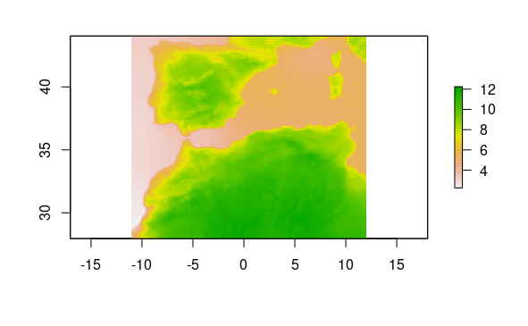
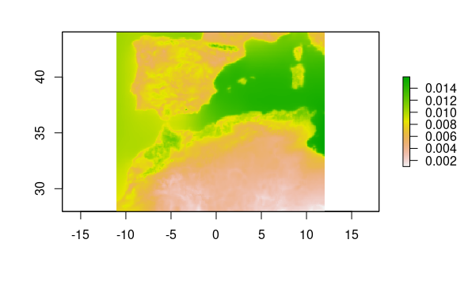
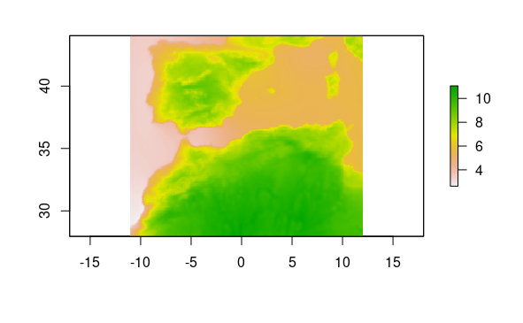
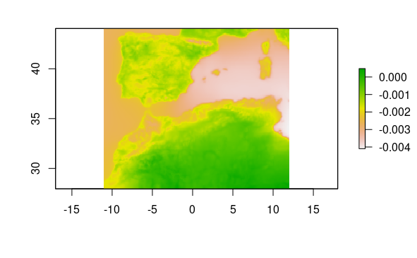
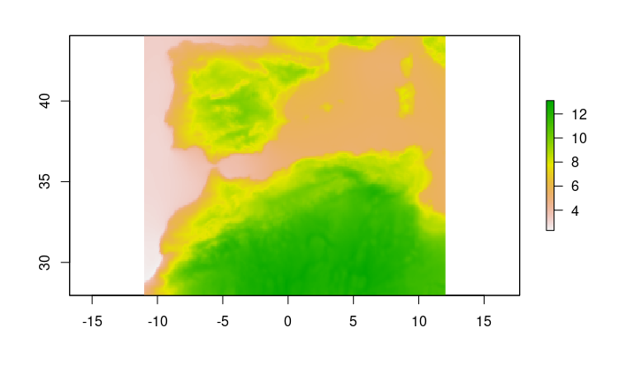
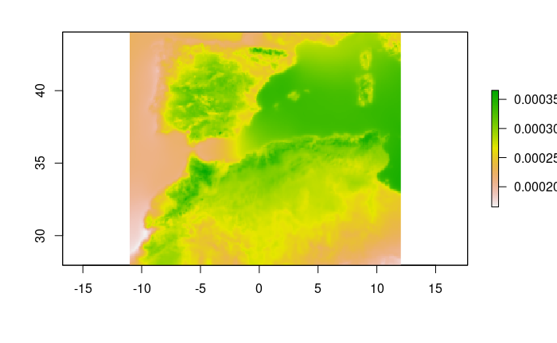

```{r, include = FALSE}
knitr::opts_chunk$set(
  collapse = TRUE,
  echo = TRUE,
  message = FALSE,
  warning = FALSE,
  eval = FALSE,
  comment = "#>"
)
```

## Dependencies and functions

In this phase, we load the necessary packages and our own function to calculate the slope, which is an indicator of climate stability.

```{r}
library(dplyr)
library(stars)
library(dsclimtools)
library(raster)

slope = function(x, t) {
  if (anyNA(x)){
    NA_real_
  } else {
    lm.fit(cbind(1, t), x)$coefficients[2]
  } 
}

```


```{r include=FALSE}
folder <- "../data/dsclim"
var <- "tas"
```

## Periods selection and parameters calculation.

One of the key applications of the package is to facilitate the study of spatio-temporal patterns during the selected period in our study area. This is a crucial aspect of biogeographical studies, where climate stability is a significant factor. For example, we select the specific time periods of interest and load the corresponding data, calculating two parameters for each period. The Median Absolute Deviation and the slope are two metrics that provide valuable insights into climate stability. The Median Absolute Deviation (MAD) offers a proxy for understanding the long-term variations in climate, while the slope serves as an indicator of the predominant direction of these changes. Once the computational work is complete, we save our example results and plot them for analysis.

### Warming in the Bolling-Allerod (14.650 to 14.400 years BP)

Here, we analyse spatio-temporal patterns for a period of 500 years during the Bølling-Allerød, a period of quick warming after the oldest Dryas.

#### Median Absolute Deviationø

In this section, we calculate the MAD of temperatures for the period 14.650 years BP and 14.400 years BP. MAD values range from ~3 to >12, indicating a contrasting levels of variation in the study region. As expected, coastal areas have been more stables while the more variable areas include the Sahara.

```{r}
tas_ds <- read_dsclim(folder, 
                      var, 
                      -14650, 
                      -14400, 
                      proxy = TRUE)
t <- st_get_dimension_values(tas_ds, "time") %>% 
     as.numeric(.)/(365*24*60*60)

out_mad <- stars::st_apply(tas_ds, 
                           MARGIN = c(1, 2), 
                           FUN=mad)

write_stars(out_mad, "mad_-14650_-14400.tif", 
            chunk_size = c(50, 50))

"mad_-14650_-14400.tif" %>% terra::rast() %>% terra::plot()
```



#### Slope

When analyzing the slope during the same period in the study area, all values are positive, indicating that the whole study area underwent warming. Again slopes values ranged from 0.002 to 0.014, indicating contrasting patterns of warning among areas. More specifically, according to the dsclim dataset, mountaineous regions (like the Pyrenees or the Atlas) has undergone more warning than lower and flatter areas.

```{r} 
out_slope <- stars::st_apply(tas_ds, 
                             MARGIN = c(1, 2), 
                             FUN = slope, 
                             t = t)

write_stars(out_slope, 
            "slope_-14650_-14400.tif",
            chunk_size = c(50, 50))

"slope_-14650_-14400.tif" %>% terra::rast() %>% plot()
```



### Cooling at the end of the Pleistocene (18.149 to -17.150 years BP)

Here, we analyze 1.000 years of progressive cooling at the end of the Pleistocene.

#### Median Absolute Deviation

MAD values range from ~3 to ~11, indicating a slightly smaller range of variation than during the warming in the Bolling-Allerod. The spatial pattern for such variation is quite similar between the two periods, with coastal areas being more stable, and the Sahara experiencing less stability.

```{r} 
tas_ds <- read_dsclim(folder,
                      var, 
                      -18149, 
                      -17150, 
                      proxy = TRUE)

t <- st_get_dimension_values(tas_ds, "time") %>% 
     as.numeric(.)/(365*24*60*60)

# reduce_data(-18150, -17150, folder=folder, var=var, FUN="mad", size=50)
out_mad <- stars::st_apply(tas_ds, 
                           MARGIN = c(1, 2), 
                           FUN = mad)

write_stars(out_mad, 
            "mad_-18149_-17150.tif", 
            chunk_size = c(50, 50))

"mad_-18149_-17150.tif" %>% terra::rast() %>% plot()
```



#### Slope

Slope values varied from -0.004 and >0, indicating that while most of the area underwent cooling, a few areas in the Sahara didn't have a temporal trend in change or even became a little warmer. The smaller range of values indicates also that the cooling was in general slower than the warming during the Bolling-Allerod.

```{r} 
out_slope <- stars::st_apply(tas_ds, 
                             MARGIN = c(1, 2), 
                             FUN = slope, 
                             t = t)

write_stars(out_slope, 
            "slope_-18149_-17150.tif", 
            chunk_size = c(50, 50))

"slope_-18149_-17150.tif" %>% terra:rast() %>% terra::plot()
```



### Last deglaciation (between 22 ky BP to present)

In this last example, we analyze the same spatio-temporal variables for the whole study period. Identifying areas subjected to more stability and with more clear temporal trends of warming.

#### Median Absolute Deviation

MAD values range between ~3 and > 12. Those values are in a similar range than what we found for the warming during the Bolling-Allerod, which is not surprising given the range and rate of change during this period. Again, the more stable areas have been the coastal areas and montainous areas (e.g. Pyrenees or Atlas).

```{r} 
tas_ds <- read_dsclim(folder, 
                      var, 
                      -22000, 
                      40, 
                      proxy = TRUE)
t <- st_get_dimension_values(tas_ds, "time") %>% 
     as.numeric(.)/(365*24*60*60)

out_mad <- stars::st_apply(tas_ds, 
                           MARGIN = c(1, 2), 
                           FUN = mad)

write_stars(out_mad, 
            "mad_-22000_40.tif", 
            chunk_size = c(50, 50))

"mad_-22000_40.tif" %>% terra::rast() %>% plot()
```



### Slope

Finally, slope shows the smallest values among the three periods, which is expected taking into account the length of the study period (22.000 years) and the relative stability at the beginning (end of glaciation) and end of the period (Holocene). The positive values indicate that the whole study area has undergone warming, with coastal areas and the Sahara experiencing smaller changes.

```{r} 
out_slope <- stars::st_apply(tas_ds, 
                             MARGIN = c(1, 2), 
                             FUN = slope, 
                             t = t, 
                             PROGRESS = TRUE)

write_stars(out_slope, 
            "slope_-22000_40.tif", 
            chunk_size = c(50, 50))

"slope_-22000_40.tif" %>% terra::rast() %>% plot()
```



