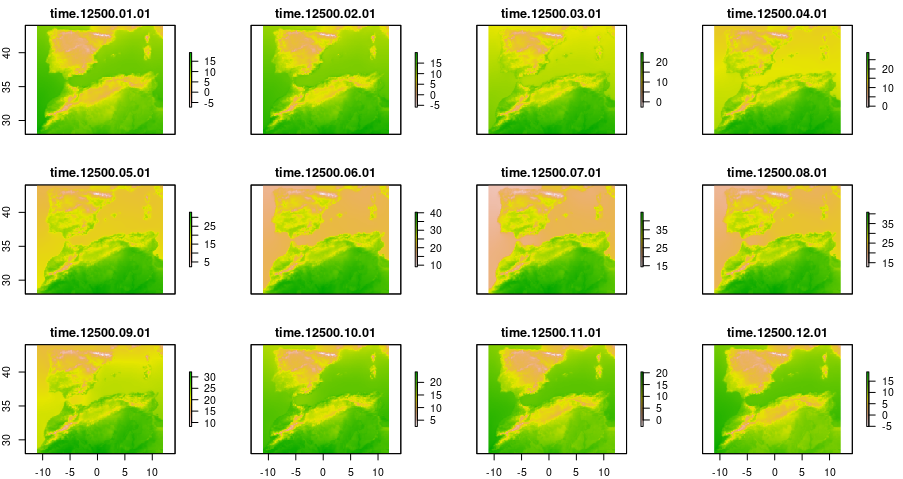

```{r, include = FALSE}
knitr::opts_chunk$set(
  collapse = TRUE,
  eval = FALSE,
  comment = "#>"
)
```

## Dependencies and functions

Here we load the necessary packages and our own functions to convert stars object to raster stack and project the model predictions.

```{r}
library(dsclimtools)
library(stars)
library(terra)
library(raster)
library(tidyverse)
library(lubridate)
library(dismo)
library(ggplot2)
library(gganimate)
library(KnowBR)

stars_to_stack <- function(i, data){
  data %>% slice("time", i:(i+11)) %>% 
    rast() %>% stack()
}

model.projection <- function(p, predictors_list, land, model) {
  predictors <- predictors_list[[p]] %>% raster::mask(land)
  prediction <- predict(predictors, model, type = "response")
  prediction
}
```

## Period selection

Here we specify our interest period

```{r}
start <- -14500
end <- -14400
```

## Extraction of source climatic data

Here we load our climatic data for the specified period. We use the stars_to_stack function to transform the loaded data into a list in which each element is a raster stack of the twelve month of each year.

```{r}
tmax <- dsclimtools::read_dsclim( "X:/Data/dsclim_v1/netcdf", "tasmax", start, end, calendar_dates = TRUE, proxy = FALSE)
tmin <- dsclimtools::read_dsclim( "X:/Data/dsclim_v1/netcdf", "tasmin", start, end, calendar_dates = TRUE, proxy = FALSE) 
t <- dsclimtools::read_dsclim( "X:/Data/dsclim_v1/netcdf", "tas", start, end, calendar_dates = TRUE, proxy = FALSE) 
prec <- dsclimtools::read_dsclim( "X:/Data/dsclim_v1/netcdf", "pr", start, end, calendar_dates = TRUE, proxy = FALSE)

tmax <- lapply(seq(1, 1212, by = 12), FUN = stars_to_stack, tmax)
tmin <- lapply(seq(1, 1212, by = 12), FUN = stars_to_stack, tmin)
t <- lapply(seq(1, 1212, by = 12), FUN = stars_to_stack, t)
prec <- lapply(seq(1, 1212, by = 12), FUN = stars_to_stack, prec)

```

{width="600"}

## Bioclimatic variables calculation

Finally, we calculate the 19 bioclimatic variables for our interest period. We store them as a list in which each element is a raster stack of the 19 bioclimatic variables

```{r}
bio_list <- mapply(dismo::biovars, prec, tmin, tmax, SIMPLIFY = FALSE)
```

## SDM data preparation

We prepared presence and absence data for running an example of species distribution model. We extracted the environmental values of the current bioclimatic variables calculated as done earlier.

```{r}
data("Beetles")

presences <- Beetles %>%
  as.data.frame() %>%
  filter(Species =="Bubas bison") %>% 
  select(Longitude, Latitude)

set.seed(1)

Present_bioclim <- system.file("extdata", "1140_bio.tif", package = "dsclimtools") %>% stack()
topo14_mask <- system.file("extdata", "topo14_mask.tif", package = "dsclimtools") %>% raster()

absences <- randomPoints(topo14_mask, 400, presences)

presvals <- raster::extract(Present_bioclim, presences, na.rm = TRUE)
presvals <-  presvals[!rowSums(is.na(presvals)),]

absvals <- raster::extract(Present_bioclim, absences, na.rm = TRUE)
absvals <-  absvals[!rowSums(is.na(absvals)),]

pb <- c(rep(1, nrow(presvals)), rep(0, nrow(absvals)))
sdmdata <- data.frame(cbind(pb, rbind(presvals, absvals)))
```

## GLM calibration and projection

Here we calibrated a Generalized Linear Model for our presence/absence dataset. Further, we projected the model over our selected period to exemplify the power of our dataset in biogeografical history studies.

```{r}
model <-  glm(pb ~ bio1 + bio2 + bio3 + bio4 + bio5 + bio6 + bio7 + 
                bio8 + bio9 + bio10 + bio11 + bio12 + bio13 + bio14 +
                bio15 + bio16 + bio17 + bio18 + bio19, data=sdmdata, family = "binomial")

pred_data <- lapply(seq(1,101), FUN = model.projection, bio_list, topo14_mask, model)
names(pred_data) <- paste0(-14500:-14400)
pred_data <- lapply(pred_data, FUN = as.data.frame, xy = TRUE, na.rm = TRUE) %>% 
  reshape2::melt(id.vars = c("x", "y", "layer")) %>% 
  mutate(year = as.numeric(L1)) 
```

## Graphical animation

Finally, we represented graphically the fluctuations of the species potential distribution along the selected period.

```{r}
pred_data$L1 <- pred_data$L1 %>% as.numeric %>% as.factor

years_list <- seq(-14500, -14400, by = 1)

levels(pred_data$year) <- unlist(lapply(years_list, FUN=function(x)last(x)))
pred_data$year <- pred_data$year %>% as.character %>% as.numeric

gg <- ggplot(
  pred_data, 
  aes(x = x, y = y, fill = layer)
) +
  geom_raster() +
  scale_fill_viridis_c() +
  labs(title = "Year: {current_frame}") +
  theme_minimal() + theme(axis.title.x = element_blank(), axis.title.y = element_blank()) 

options(gganimate.dev_args = list(width = 600, height = 400))
gganim <- gg + transition_manual(year)

animate(gganim, duration = 60, width = 600, height = 400, renderer = gifski_renderer())
```


