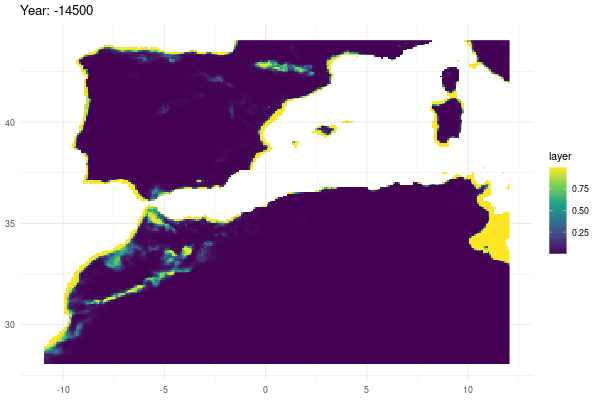

```{r, include = FALSE}
knitr::opts_chunk$set(
  collapse = TRUE,
  eval = FALSE,
  comment = "#>"
)
```

It is standard practice in biogeography studies to derive new variables from existing climatic data, as this makes it easier to interpret the data ecologically. One example of this is the calculation of bioclimate variables. Furthermore, these variables are typically employed as inputs for ecological modelling tools, such as Species Distribution Models (SDMs), which correlate them with species occurrences to estimate potential distribution across an area of interest. In this example, we have calculated a set of bioclimatic variables for the specified study periods and used them to calibrate a Species Distribution Model (SDM) which was projected into past conditions.

## Dependencies and functions

In this step, we load the necessary packages and our own functions in order to convert the star object to a raster stack (we transform our data from cube format into a stack to use typicall functions of spatial analysis ) and project the resulting model predictions into the past.

```{r}
library(dsclimtools)
library(stars)
library(terra)
library(raster)
library(tidyverse)
library(lubridate)
library(dismo)
library(ggplot2)
library(gganimate)
library(KnowBR)

stars_to_stack <- function(i, data){
  data %>% slice("time", i:(i+11)) %>% 
    rast() %>% stack()
}

model.projection <- function(p, predictors_list, land, model) {
  predictors <- predictors_list[[p]] %>% 
                raster::mask(land)
  prediction <- predict(predictors, 
                        model, 
                        type = "response")
  prediction
}
```

## Period selection {.tabset .tabset-pills}

In this section, we outline the periods of interest.

### PRESENT

```{r present_period}
present_start <- 11
present_end <- 40
```

### PAST

```{r past_period}
past_start <- -14500
past_end <- -14400
```

## Extraction of source climatic data {.tabset .tabset-pills}

In this step, we load the climatic data for the specified period. The data is transformed into a list using the stars_to_stack function, with each element representing a raster stack of the twelve months in each year.

### PRESENT

```{r}
present_tmax <- dsclimtools::read_dsclim( "../data/dsclim", 
                                          "tasmax",
                                          present_start, 
                                          present_end, 
                                          calendar_dates = TRUE, 
                                          proxy = FALSE)

present_tmin <- dsclimtools::read_dsclim( "../data/dsclim",
                                          "tasmin",
                                          present_start, 
                                          present_end, 
                                          calendar_dates = TRUE, 
                                          proxy = FALSE) 

present_prec <- dsclimtools::read_dsclim( "../data/dsclim", 
                                          "pr",
                                          present_start, 
                                          present_end, 
                                          calendar_dates = TRUE, 
                                          proxy = FALSE)

present_tmax <- lapply(seq(1, 360, by = 12), 
                       FUN = stars_to_stack, 
                       present_tmax)

present_tmin <- lapply(seq(1, 360, by = 12), 
                       FUN = stars_to_stack, 
                       present_tmin)

present_prec <- lapply(seq(1, 360, by = 12),
                       FUN = stars_to_stack, 
                       present_prec)
```

{width="600"}

### PAST

```{r}
tmax <- dsclimtools::read_dsclim( "../data/dsclim", 
                                  "tasmax",
                                  past_start, 
                                  past_end, 
                                  calendar_dates = TRUE,
                                  proxy = FALSE)

tmin <- dsclimtools::read_dsclim( "../data/dsclim", 
                                  "tasmin",
                                  past_start, 
                                  past_end, 
                                  calendar_dates = TRUE,
                                  proxy = FALSE) 

prec <- dsclimtools::read_dsclim( "../data/dsclim",
                                  "pr",
                                  past_start, 
                                  past_end, 
                                  calendar_dates = TRUE,
                                  proxy = FALSE)

tmax <- lapply(seq(1, 1212, by = 12), 
               FUN = stars_to_stack, 
               tmax)

tmin <- lapply(seq(1, 1212, by = 12), 
               FUN = stars_to_stack, 
               tmin)

prec <- lapply(seq(1, 1212, by = 12),
               FUN = stars_to_stack, 
               prec)

```

{width="600"}

## Bioclimatic variables calculation {.tabset .tabset-pills}

We have now calculated the 19 bioclimatic variables for the specified periods of interest in accordance with the agreed specifications. The data is stored in the form of a list, with each element representing a raster stack of the 19 bioclimatic variables. Please note that for the present period, the mean has been calculated in order to create a unique grid for each variable, which will be used later in the model calibration process. In both cases, we selected the variables that we intend to use in our model. As this example has been developed based on the guidance set out in <https://rspatial.org/raster/sdm/raster_SDM.pdf>, we have maintained consistency in the bioclimatic variables used. It is important to note that this is solely for illustrative purposes. In actual modelling, it would be advisable to select variables based on their ecological impact on the study species and their correlation.

### PRESENT

```{r}
present_bio_list <- mapply(dismo::biovars, 
                           present_prec, 
                           present_tmin, 
                           present_tmax,
                           SIMPLIFY = FALSE)

Present_bioclim <- stack(reduce(present_bio_list, `+`) / length(present_bio_list)) %>% 
                   subset(c(1,5,6,7,8,12,16,17))
```

### PAST

```{r}
bio_list <- mapply(dismo::biovars, 
                   prec, 
                   tmin, 
                   tmax, 
                   SIMPLIFY = FALSE) %>% 
  
            lapply(function(x){
              subset(x, c(1,5,6,7,8,12,16,17))
            })
```

## SDM data preparation

We have prepared the presence and absence data in order to run an example of a species distribution model. Please note that we have loaded a topography mask to ensure that all points are within the designated land area. The pseudo-absences points were generated randomly. Once the required data had been collated, we extracted the current values of the selected variables for the specified locations.

```{r}
data("Beetles")

presences <- Beetles %>%
  as.data.frame() %>%
  filter(Species == "Bubas bison") %>% 
  select(Longitude, Latitude)

set.seed(1)

topo14_mask <- system.file("extdata", 
                           "topo14_mask.tif", 
                           package = "dsclimtools") %>% 
               raster()

absences <- randomPoints(topo14_mask, 
                         400, 
                         presences)

presvals <- raster::extract(Present_bioclim, 
                            presences, 
                            na.rm = TRUE)

presvals <-  presvals[!rowSums(is.na(presvals)),]

absvals <- raster::extract(Present_bioclim, 
                           absences, 
                           na.rm = TRUE)

absvals <-  absvals[!rowSums(is.na(absvals)),]

pb <- c(rep(1, nrow(presvals)), 
        rep(0, nrow(absvals)))

sdmdata <- data.frame(cbind(pb, 
                            rbind(presvals, absvals)))
```

## GLM calibration and projection

We calibrated a Generalized Linear Model for our dataset in line with the specified requirements. Moreover, we projected the model over current conditions as well as the selected period conditions to illustrate the value of our dataset in biogeographical history studies.

```{r}
model <-  glm(pb ~ bio1 + bio5 + bio6 + bio7 + bio8 + bio12 + bio16 + bio17, 
              data=sdmdata, 
              family = "binomial")

present_prediction <- Present_bioclim %>% 
                      raster::mask(topo14_mask) %>% 
                      predict(model, type = "response") %>% 
                      as.data.frame(xy = TRUE) %>% na.omit()

pred_data <- lapply(seq(1,101), 
                    FUN = model.projection, 
                    bio_list, 
                    topo14_mask, 
                    model)

names(pred_data) <- paste0(-14500:-14400)

pred_data <- lapply(pred_data, 
                    FUN = as.data.frame, 
                    xy = TRUE, 
                    na.rm = TRUE) %>% 
             reshape2::melt(id.vars = c("x", "y", "layer")) %>% 
             mutate(year = as.numeric(L1)) 

pred_data$L1 <- pred_data$L1 %>% 
                as.numeric %>% 
                as.factor

years_list <- seq(-14500, -14400, by = 1)

levels(pred_data$year) <- unlist(lapply(years_list, FUN=function(x)last(x)))

pred_data$year <- pred_data$year %>% 
                  as.character %>% 
                  as.numeric
```

## Plotting the data {.tabset .tabset-pills}

Furthermore, we have provided a graphical illustration of the fluctuations in the potential distribution of the species over the specified period, as well as its current predicted distribution. Additionally, we have calculated the pixel mean value and identified those which have a mean value greater than 0.7, which we believe will be of interest to those engaged in biogeographical studies such as the identification of refugia.

### CURRENT PREDICTED DISTRIBUTION

```{r}

present_prediction %>% ggplot() +
  geom_raster(aes(x = x, 
                  y = y, 
                  fill = layer)) +
  scale_fill_viridis_c() +
  theme_bw() + 
  theme(axis.title.x = element_blank(), 
        axis.title.y = element_blank()) 

```

{width="640"}

### GRAFICAL ANIMATION

```{r}
gg <- ggplot(
  pred_data, 
  aes(x = x, y = y, fill = layer)
) +
  geom_raster() +
  scale_fill_viridis_c() +
  labs(title = "Year: {current_frame}") +
  theme_minimal() + 
  theme(axis.title.x = element_blank(), 
        axis.title.y = element_blank()) 

options(gganimate.dev_args = list(width = 600, 
                                  height = 400))
gganim <- gg + 
  transition_manual(year)

animate(gganim, 
        duration = 60, 
        width = 600, 
        height = 400, 
        renderer = gifski_renderer())

```



### OVER THRESHOLD MAP

```{r}
mean_data <- pred_data %>% 
  group_by(x, y) %>% 
  summarize(mean_layer = mean(layer)) %>% 
  mutate(th_layer = case_when(mean_layer >= 0.7 ~ 1,
                              mean_layer < 0.7 ~ 0))


mean_data %>% ggplot() +
  geom_raster(aes(x = x, 
                  y = y, 
                  fill = th_layer)) +
  scale_fill_viridis_c() +
  theme_bw() + 
  theme(axis.title.x = element_blank(), 
        axis.title.y = element_blank()) 

```

{width="631"}
