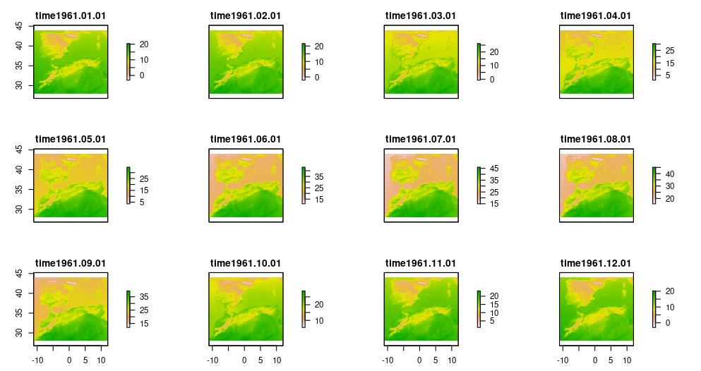
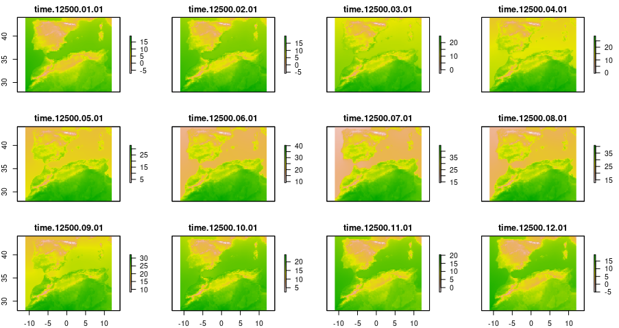
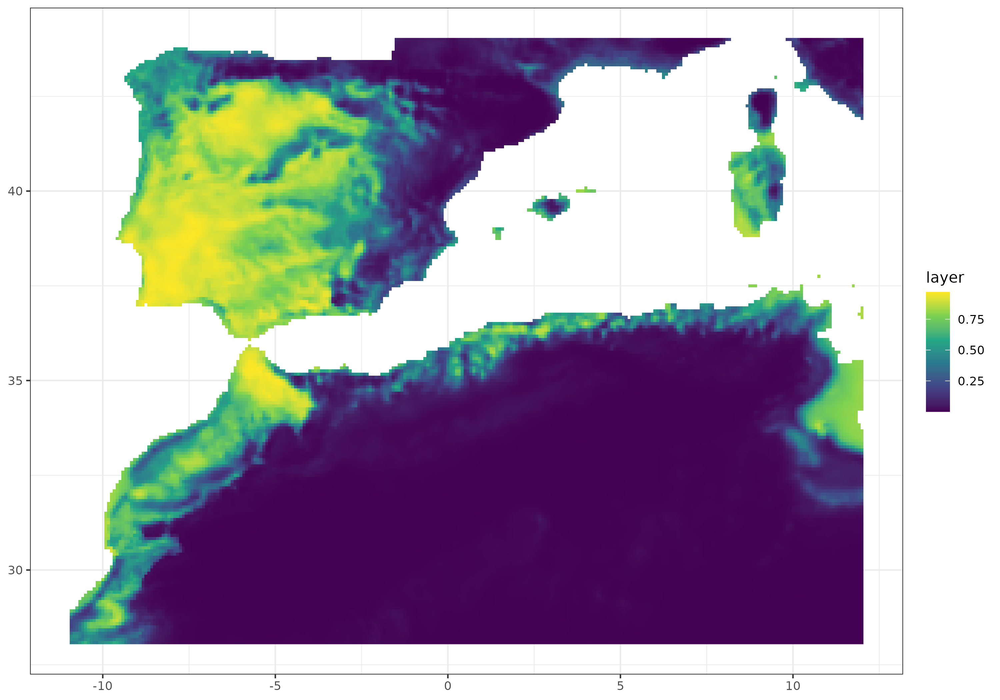
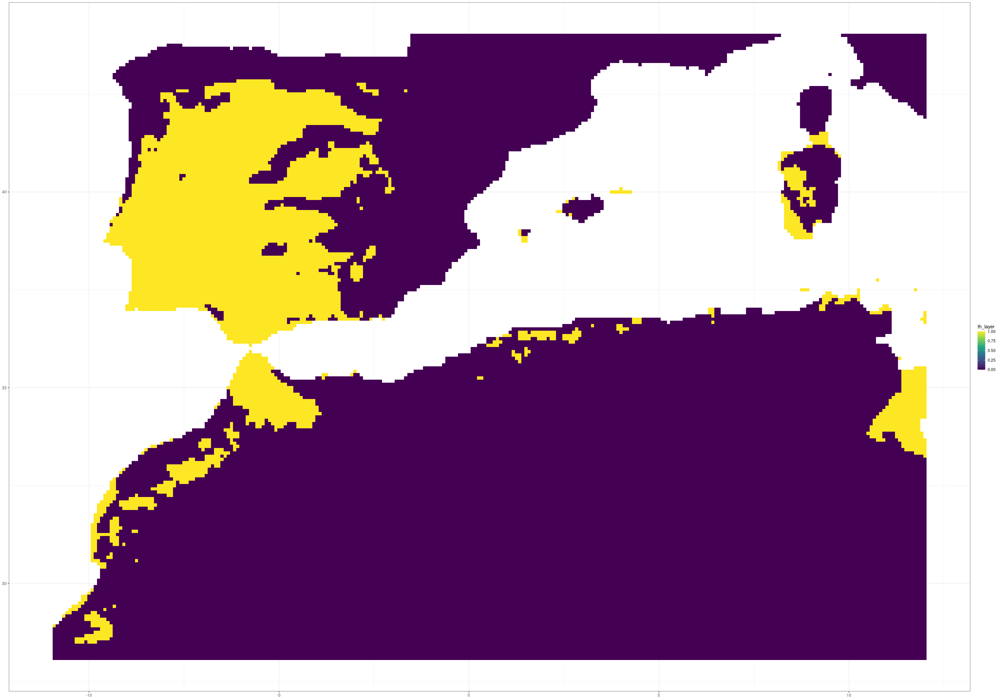
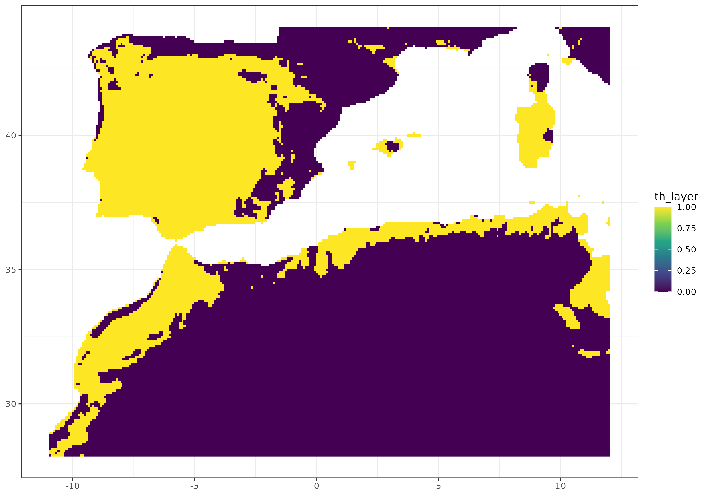

```{r, include = FALSE}
knitr::opts_chunk$set(
  collapse = TRUE,
  eval = FALSE,
  comment = "#>"
)
```

It is standard practice in biogeography to derive new variables from existing climatic data, as this makes it easier to interpret the data ecologically. One example of this is the calculation of bioclimate variables. Furthermore, these variables are typically employed as inputs for ecological modelling tools, such as Species Distribution Models (SDMs), which correlate them with species occurrences to estimate potential distribution across an area of interest. In this example, we have calculated a set of bioclimatic variables for the specified study periods and used them to calibrate a Species Distribution Model (SDM) which was projected into past conditions.


## Dependencies and functions

First, we load several packages and define a couple of functions to convert the star object into a raster stack (we transform our data from cube format into a stack to use typical functions of spatial analysis) and to project SDMs into the bioclim variables at different time periods.

```{r}

library(dsclimtools)
library(stars)
library(terra)
library(raster)
library(tidyverse)
library(lubridate)
library(dismo)
library(ggplot2)
library(gganimate)
library(KnowBR)

stars_to_stack <- function(i, data){
  data %>% slice("time", i:(i+11)) %>% 
    rast() %>% stack()
}

model.projection <- function(p, predictors_list, land, model) {
  predictors <- predictors_list[[p]] %>% 
                raster::mask(land)
  prediction <- predict(predictors, 
                        model, 
                        type = "response")
  prediction
}
```


## Defining periods

In order to load dsclim dataset, we define two periods of interest. The first one is contemporary to be used when fitting SDMs. The second one is past to project SDMs into a hindcasting exercise.

```{r present_period}

present_start <- 11
present_end <- 40

past_start <- -14500
past_end <- -14400
```


## Load downscaled climatic data (dsclim) {.tabset .tabset-pills}

Now, we load the climatic data for the specified period and three variables (e.g. maximum temperature, minimum temperature and precipitation). The `read_dsclim()` function return a `stars` object that we afterwards convert into a list of raster stack (one for each year) using the `stars_to_stack` function. The stacks include 12 layers, representing the twelve months in each year.

We repeat the same for the two periods: present and past.


### Present

```{r}

present_tmax <- dsclimtools::read_dsclim( "../data/dsclim", 
                                          "tasmax",
                                          present_start, 
                                          present_end, 
                                          calendar_dates = TRUE, 
                                          proxy = FALSE)

present_tmin <- dsclimtools::read_dsclim( "../data/dsclim",
                                          "tasmin",
                                          present_start, 
                                          present_end, 
                                          calendar_dates = TRUE, 
                                          proxy = FALSE) 

present_prec <- dsclimtools::read_dsclim( "../data/dsclim", 
                                          "pr",
                                          present_start, 
                                          present_end, 
                                          calendar_dates = TRUE, 
                                          proxy = FALSE)

present_tmax <- lapply(seq(1, 360, by = 12), 
                       FUN = stars_to_stack, 
                       present_tmax)

present_tmin <- lapply(seq(1, 360, by = 12), 
                       FUN = stars_to_stack, 
                       present_tmin)

present_prec <- lapply(seq(1, 360, by = 12),
                       FUN = stars_to_stack, 
                       present_prec)

plot(present_tmax[[1]])
```

{width="600"}


### Past

```{r}

past_tmax <- dsclimtools::read_dsclim( "../data/dsclim", 
                                  "tasmax",
                                  past_start, 
                                  past_end, 
                                  calendar_dates = TRUE,
                                  proxy = FALSE)

past_tmin <- dsclimtools::read_dsclim( "../data/dsclim", 
                                  "tasmin",
                                  past_start, 
                                  past_end, 
                                  calendar_dates = TRUE,
                                  proxy = FALSE) 

past_prec <- dsclimtools::read_dsclim( "../data/dsclim",
                                  "pr",
                                  past_start, 
                                  past_end, 
                                  calendar_dates = TRUE,
                                  proxy = FALSE)

past_tmax <- lapply(seq(1, 1212, by = 12), 
               FUN = stars_to_stack, 
               past_tmax)

past_tmin <- lapply(seq(1, 1212, by = 12), 
               FUN = stars_to_stack, 
               past_tmin)

past_prec <- lapply(seq(1, 1212, by = 12),
               FUN = stars_to_stack, 
               past_prec)

plot(past_tmax[[1]])
```

{width="600"}


## Calculate bioclimatic variables {.tabset .tabset-pills}

We can calculate the 19 bioclimatic variables for each year in the two periods. The result is, hence, stored as a list of raster stacks with 19 layers (19 bioclimatic variables). For present, we calculate the mean of the 19 variables across the 30 years of the period to create a unique grid, which will then be used in model calibration. 

Then, we selected the same subset of variables in both periods following the same criteria than the tutorial in [https://rspatial.org/raster/sdm/raster_SDM.pdf](https://rspatial.org/raster/sdm/raster_SDM.pdf). Note that our intent with this vignette is solely for illustrative purposes. In actual modelling, it would be advisable to select variables based on their ecological impact on the study species and their correlation.


### Present

```{r}

present_bio_list <- mapply(dismo::biovars, 
                           present_prec, 
                           present_tmin, 
                           present_tmax,
                           SIMPLIFY = FALSE)

Present_bioclim <- stack(reduce(present_bio_list, `+`) / length(present_bio_list)) %>% 
                   subset(c(1, 5, 6, 7, 8, 12, 16, 17))
```


### Past

```{r}

past_bio_list <- mapply(dismo::biovars, 
                   past_prec, 
                   past_tmin, 
                   past_tmax, 
                   SIMPLIFY = FALSE) %>% 
  lapply(function(x){
    subset(x, c(1, 5, 6, 7, 8, 12, 16, 17))
  })
```


## Occurrence data

To illustrate SDMs with our dataset, we used occurrences of the species *Bubas bison* from the `Beetles` dataset in the `KnowBR` package. Pseudo-absences points were generated randomly. We also loaded a topography mask to ensure that all points (i.e. presences and pseudo-absences) are within the designated land area. Once the required data had been collated, we extracted values from the bioclimatic variables of the selected variables at the occurrence (e.g. presences and pseudo-absences) locations.

```{r}

data("Beetles", package = "KnowBR")

presences <- Beetles %>%
  as.data.frame() %>%
  filter(Species == "Bubas bison") %>% 
  select(Longitude, Latitude)

topo14_mask <- system.file("extdata", 
                           "topo14_mask.tif", 
                           package = "dsclimtools") %>% 
               raster()

set.seed(1)
absences <- randomPoints(topo14_mask, 
                         400, 
                         presences)

presvals <- terra::extract(Present_bioclim, 
                            presences, 
                            na.rm = TRUE) %>% 
  as.data.frame()

presvals <- presvals %>% drop_na()

absvals <- raster::extract(Present_bioclim, 
                           absences, 
                           na.rm = TRUE) %>% 
  as.data.frame()

absvals <- absvals %>% drop_na()

pb <- c(rep(1, nrow(presvals)), 
        rep(0, nrow(absvals)))

sdmdata <- data.frame(cbind(pb, 
                            rbind(presvals, absvals)))
```

## GLM calibration

We calibrated a Generalized Linear Model (GLM) for the occurrence in relation to the bioclimatic variables. 

```{r}

model <-  glm(pb ~ bio1 + bio5 + bio6 + bio7 + bio8 + bio12 + bio16 + bio17, 
              data = sdmdata, 
              family = "binomial")
```


## Model projection under current conditions {.tabset .tabset-pills}

Then, we can project the model over current conditions and plot it both in its continuous or binary form. For the binary prediction, we threshold the prediction using the 0.7 threshold.


### Continuous prediction

```{r}

present_prediction <- Present_bioclim %>% 
                      raster::mask(topo14_mask) %>% 
                      predict(model, type = "response") %>% 
                      as.data.frame(xy = TRUE) %>% na.omit()

present_prediction %>% ggplot() +
  geom_raster(aes(x = x, 
                  y = y, 
                  fill = layer)) +
  scale_fill_viridis_c() +
  theme_bw() + 
  theme(axis.title.x = element_blank(), 
        axis.title.y = element_blank()) 
```

{width="640"}


### Binary prediction

```{r}


present_prediction <- Present_bioclim %>% 
                      raster::mask(topo14_mask) %>% 
                      predict(model, type = "response") %>% 
                      as.data.frame(xy = TRUE) %>% na.omit()

present_prediction %>% 
  mutate(th_layer = case_when(layer >= 0.7 ~ 1,
                              layer < 0.7 ~ 0)) %>% 
  ggplot() +
  geom_raster(aes(x = x, 
                  y = y, 
                  fill = th_layer)) +
  scale_fill_viridis_c() +
  theme_bw() + 
  theme(axis.title.x = element_blank(), 
        axis.title.y = element_blank()) 
```

{width="640"}


## Model projection under past conditions {.tabset .tabset-pills}

Now, we use the model to project under past climate conditions.

```{r}

past_prediction <- lapply(seq(1, 101), 
                    FUN = model.projection, 
                    past_bio_list, 
                    topo14_mask, 
                    model)

names(past_prediction) <- paste0(-14500:-14400)

past_prediction <- lapply(past_prediction, 
                    FUN = as.data.frame, 
                    xy = TRUE, 
                    na.rm = TRUE) %>% 
             reshape2::melt(id.vars = c("x", "y", "layer")) %>% 
             mutate(year = as.numeric(L1)) 

past_prediction$L1 <- past_prediction$L1 %>% 
                as.numeric() %>% 
                as.factor()

years_list <- seq(-14500, -14400, by = 1)

levels(past_prediction$year) <- years_list %>% 
  lapply(FUN = last) %>%
  unlist()

past_prediction$year <- past_prediction$year %>% 
                  as.character() %>% 
                  as.numeric()
```


## Plotting past projections {.tabset .tabset-pills}

Furthermore, we provide a graphical illustration of the fluctuations in the potential distribution of the species over past conditions. Additionally, we have calculated the pixel mean value for the whole period and identified those which have a mean value greater than 0.7.


### Dynamic projection

```{r}

gg <- ggplot(
  past_prediction, 
  aes(x = x,
      y = y, 
      fill = layer)) +
  geom_raster() +
  scale_fill_viridis_c() +
  labs(title = "Year: {current_frame}") +
  theme_minimal() + 
  theme(axis.title.x = element_blank(), 
        axis.title.y = element_blank()) 

options(gganimate.dev_args = list(width = 600, 
                                  height = 400))

gganim <- gg + 
  transition_manual(year)

animate(gganim, 
        duration = 60, 
        width = 600, 
        height = 400, 
        renderer = gifski_renderer())
```


### Binary mean projection

```{r}

mean_data <- past_prediction %>% 
  group_by(x, y) %>% 
  summarize(mean_layer = mean(layer)) %>% 
  mutate(th_layer = case_when(mean_layer >= 0.7 ~ 1,
                              mean_layer < 0.7 ~ 0))

mean_data %>% ggplot() +
  geom_raster(aes(x = x, 
                  y = y, 
                  fill = th_layer)) +
  scale_fill_viridis_c() +
  theme_bw() + 
  theme(axis.title.x = element_blank(), 
        axis.title.y = element_blank()) 

```

 {width="631"}
 
